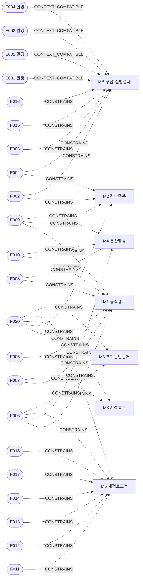
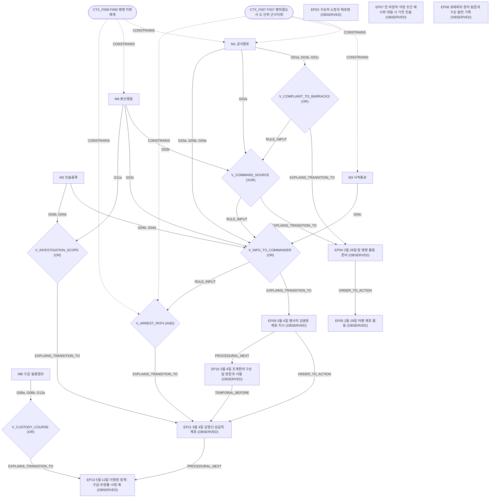

# Mechanism Super-DAG (Qualitative SCM)

> 이 문서는 질적 메커니즘 분석이다. 메커니즘은 역사적 사실이 아니라 분석 변수다. World는 메커니즘의 configuration, Observed fact는 고정, Context feature는 제약조건, Latent bridge는 가설, Outcome(재검토·판단·처분)은 confirmed backbone이다. 확률·SEM 계수·practice prior는 쓰지 않았다.

```
[Institutional Context F001–F020]  ── CONSTRAINS ──▶  [Mechanism Layer M1–M6, MB]
                                                         │ INSTANTIATED_BY
                                                         ▼
                                              [LATENT 후보 38개 (기존, 등급 그대로)]
                                                         │ CONTRIBUTES_TO
                                                         ▼
                                              [질적 구조 변수 V_*]
                                                         │ EXPLAINS_TRANSITION_TO
                                                         ▼
[Observed Event Layer: 정보 전달 → 체포 → 구금 → 5월 판단 → 독립 재검토 → 6월 판단 수정 → 책임 귀속 → 처분]  (frozen, 그대로)
[Environment Context E001–E004]  ── CONTEXT_COMPATIBLE ──▶ MB  /  (frozen) CONTEXT_SUPPORTS ──▶ 사인 판단 node
```

- node: CONTEXT 24, LATENT_MECHANISM 55, OBSERVED 37, UNRESOLVED 6
- edge: CONTEXT 38, DERIVED 64, LATENT_MECHANISM 90, OBSERVED 4, UNRESOLVED 9
- frozen observed graph(node 41, edge 68)는 그대로 복사했다. 동결 해시 `ccb7ec63763a715a…`. 환경 node는 Super-DAG에서 CONTEXT로 표시한다(frozen 표기는 OBSERVED 그대로).

## 1. 메커니즘 정의

| mechanism_id | mechanism_name | 아주 쉬운 설명 | 관련 candidate | 관련 observed node | 필요한 institutional feature | 관련 environment feature | evidence status | 비고 |
|---|---|---|---|---|---|---|---|---|
| M1 | M1_OFFICIAL_INFORMATION_ROUTE | 구순 쪽 소장·정보가 진영·병영 비장·병사로 이어지는 공식 보고·지휘 경로를 따라 이동하는 구조 | G01a/G01b/G01c/G02a/G03a/G03b/G04a/G11b | EP03, EP04, EP05, EP08, EP09 | F005, F006, F007, F008, F009, F010, F020 | - | MEDIUM 4 / LOW 1 / NONE 3 | 공식 경로가 제도상 가능하다는 것(F007·F008)은 경로가 실제로 쓰였다는 근거가 아니다. |
| M2 | M2_TESTIMONY_AMPLIFICATION | 자미덕 등의 진술·대질·번복이 수사 범위나 판단 자료를 키우거나 바꾸는 구조 | G04b/G04d/G07b/G07c | EP07, EP09, EP13, EP15 | F002, F004, F009, F020 | - | MEDIUM 1 / LOW 3 | 회유 행위 자체의 합법성은 LOW(F002, EP07 feature link)다. 진술이 보고 경로를 탄다는 정보 흐름만 MEDIUM이다. |
| M3 | M3_PRIVATE_INFLUENCE_CHANNEL | 구순과 병영 지휘관 사이의 비공식·사적 통로(서신·접촉)를 통해 정보나 영향이 전달되는 구조 | G04c/G04e/G05a/G05b | EP01, EP09, EP10, EP11, EP30 | F007, F020 | - | LOW 2 · 분석 제외 G04e/G05b | 구순(전 부사)에게는 병영 지휘권이 없다(F007 role LOW). 그래서 M3는 '명령'이 아니라 '정보·영향 제공'으로만 쓸 수 있다(G04e INCOMPATIBLE). |
| M4 | M4_DISTRIBUTED_INSTITUTIONAL_ACTION | 하나의 중앙 지휘가 아니라 비장·아전·진(鎭) 등 여러 기관·실무자의 판단이 따로 쌓이는 구조 | G02b/G02c/G03c/G11a/G11c | EP04, EP05, EP08, EP09 | F006, F008, F009, F010 | - | LOW 2 / NONE 1 · 분석 제외 G02c/G11c | F006(관찰사 감독)·F009(비장 막료)는 분산 실무의 여지를 주지만, 그 자체가 분산 행동의 근거는 아니다. |
| M5 | M5_REVIEW_AND_CORRECTION | 초기 판단을 암행어사·안핵어사·비변사·국왕 심리가 따로 다시 검토하고 고치는 구조 | G08a/G08b/G09a/G09b/G09c/G10a/G10b/G10c/G13a/G13b | EP04, EP07, EP15, EP16, EP17, EP18, EP19, EP20, EP21, EP22, EP23, EP24, EP25, EP26, EP27, EP28, EP29, EP30, EP31, EP32, EP33, EP34, EP35, EP36, EP37 | F006, F011, F012, F013, F014, F017, F018, F020 | - | 관측 backbone 고정(OBSERVED) · 내부 세부 후보: MEDIUM 1 / LOW 4 / NONE 2 · 분석 제외 G09b/G09c/G13b | 재검토 과정 자체(5/12 → 5/27 → 5/28 → 6/11 → 6/13 → 처분)는 OBSERVED backbone이다. M5는 그 backbone을 설명하는 분석 변수이고, LATENT 후보(G08·G09·G10·G13)는 동기·근거·실행 같은 내부 세부만 다룬다. 관측 사건을 LATENT로 바꾸지 않는다. |
| M6 | M6_INITIAL_JUDGMENT_BASIS | 5월 단계의 '도난 없음 방향' 판단이 어떤 자료·추론에서 형성되었는지에 관한 구조 | G07a/G07d (보조: G07b/G07c) | EP13, EP15, EP25 | F006, F020 | - | LOW 1 · 분석 제외 G07d | G07 계열이 반복되는 패턴이라 추가했다. 5월 판단 자체(EP15)는 OBSERVED이고, 그 근거만 LATENT다. |
| MB | MB_CUSTODY_BIOLOGICAL_COURSE | 체포 뒤 구금 중 발병·사망 경과에 관한 구조(사망 branch A: 생물학적 사인) | G06a/G06b/G06c/G12a/G12b | EP11, EP13, EP27 | F002, F003, F004, F015, F016 | E001, E002, E003, E004 | MEDIUM 1 / LOW 2 · 분석 제외 G06c/G12b | 환경 피쳐는 질병·사망 설명의 호환성만 제약한다. 김명신 개인의 감염을 확정하지 않는다. 책임 branch(M1–M4)와 연결하지 않는다. |

M6(초기 판단 근거)와 MB(구금·질병 경과)는 요청된 M1–M5 밖에서 추가했다. G07 계열과 G06·G12 계열이 반복되는 패턴이고, MB는 사망 branch A를 책임 branch와 분리하려면 별도 변수가 필요하기 때문이다. 새 후보나 새 사건은 만들지 않았다.

후보 매핑 메모:

- G02b: '상위 명령 없이' 출동을 지시했다는 주장이라 M1의 지휘 부분(G02a)을 부정한다.
- G05b: 서찰이 사건과 무관했다는 주장이라 M3이 그 지점에서 작동하지 않았다고 본다.
- G13b: 의금부 신문이 진행되지 않았다는 주장이라 M5 내부 세부(실행)를 부정한다. 재검토 backbone 자체는 OBSERVED라 영향이 없다.
- G01b: 소장의 병영 직접 접수는 공식 제출 경로라 M1로 분류했다. W3에서는 사적 통로(M3)와 함께 쓰인다.
- G07b: 회동 조사 응답자 진술의 채택. 진술이 판단 자료를 바꾸는 구조라 M2가 주이고 M6이 보조다.
- G07c: 진술 번복이 5월 자료에 들어감. M2가 주이고 M6이 보조다.

## 2. 제도 피쳐가 제약하는 메커니즘

| 피쳐 | 이름 | 제약하는 메커니즘 |
|---|---|---|
| F002 | 흠휼전칙 현행 | M2, MB |
| F003 | 군문 중곤 사용 제한 | MB |
| F004 | 구금 도구 기준 | M2, MB |
| F005 | 수령의 군현 통치 | M1 |
| F006 | 관찰사의 수령 감독·직계 | M1, M4, M5, M6 |
| F007 | 병마절도사 도 단위 군사지휘 | M1, M3 |
| F008 | 병영 지휘체계 | M1, M4 |
| F009 | 비장 막료 체계 | M1, M2, M4 |
| F010 | 토포사 제도 | M1, M4 |
| F011 | 형조 심리·회계 | M5 |
| F012 | 의금부 특별사법·재심 | M5 |
| F013 | 암행어사 | M5 |
| F014 | 안핵어사 | M5 |
| F015 | 초검-복검-추가검 | MB |
| F016 | 증수무원록 개정 지침 | MB |
| F017 | 비변사 심의 | M5 |
| F018 | 수교의 법적 성격 | M5 |
| F020 | 장계·서계·계문·회계 | M1, M2, M3, M5, M6 |

메커니즘에 연결하지 않은 제도 피쳐: F001, F019(이 사건 메커니즘의 가능성을 직접 제약하지 않음).

## 3. World = 메커니즘 configuration

값은 world의 실제 bridge 구성에서 규칙으로 계산했다(손으로 넣지 않음). ON: 핵심 gap을 그 메커니즘의 core 후보로 채움. PARTIAL: 보조 후보만 쓰거나 같은 world에 부정 후보가 함께 있음. OFF: 부정 후보만 있음. UNSPECIFIED: 관련 후보 없음(OFF가 아니다). M5는 관측 backbone에 고정되어 모든 world에서 ON이다.

| World | 구분 | M1 공식경로 | M2 진술증폭 | M3 사적통로 | M4 분산행동 | M5 재검토교정 | M6 초기판단근거 | MB 구금·질병경과 | 비고 |
|---|---|---|---|---|---|---|---|---|---|
| W1 | COMPETING_EXPLANATION | ON | UNSPECIFIED | PARTIAL | PARTIAL | ON | ON | ON | 정조는 어떤 책임 구조를 보고 처분했는가? |
| W2 | COMPETING_EXPLANATION | PARTIAL | ON | UNSPECIFIED | ON | ON | PARTIAL | ON | 자미덕의 진술은 수사를 얼마나 확대시켰을 수 있는가? |
| W3 | COMPETING_EXPLANATION | PARTIAL | UNSPECIFIED | ON | UNSPECIFIED | ON | ON | ON | 구순의 사적 영향력이 별도로 작동했을 가능성이 있는가? |
| W4 | COMPETING_EXPLANATION | PARTIAL | PARTIAL | UNSPECIFIED | ON | ON | PARTIAL | ON | 한 명의 지휘자가 아니라 여러 기관의 판단 누적이 사건을 키웠는가? |
| W5 | COMPETING_EXPLANATION | PARTIAL | UNSPECIFIED | UNSPECIFIED | UNSPECIFIED | ON | ON | ON | 사료에 없는 것을 거의 채우지 않으면 무엇만 남는가? |
| W6 | REJECTED | UNSPECIFIED | UNSPECIFIED | UNSPECIFIED | UNSPECIFIED | ON | ON | ON | 검토했지만 배제된 설명. 공존·개입 분석에서 제외한 대조군 |

판정 근거(world × 메커니즘):

- **W1**: M1 ON (core G01a, G02a, G03a, G04a) · M2 UNSPECIFIED (관련 후보 없음) · M3 PARTIAL (보조 G05a) · M4 PARTIAL (보조 G11a) · M5 ON (관측 재검토 backbone(EP15–EP37)에 고정; 내부 세부 G08a, G09a, G13a) · M6 ON (core G07a) · MB ON (core G06a; 보조 G12a)
- **W2**: M1 PARTIAL (core G01a, G03a; 부정 G02b) · M2 ON (core G04b; 보조 G07c) · M3 UNSPECIFIED (관련 후보 없음) · M4 ON (core G02b) · M5 ON (관측 재검토 backbone(EP15–EP37)에 고정; 내부 세부 G08a, G09a) · M6 PARTIAL (보조 G07c) · MB ON (core G06b; 보조 G12a)
- **W3**: M1 PARTIAL (core G01b, G02a) · M2 UNSPECIFIED (관련 후보 없음) · M3 ON (core G04c; 보조 G05a) · M4 UNSPECIFIED (관련 후보 없음) · M5 ON (관측 재검토 backbone(EP15–EP37)에 고정; 내부 세부 G08a) · M6 ON (core G07a) · MB ON (core G06a; 보조 G12a)
- **W4**: M1 PARTIAL (core G01a; 부정 G02b) · M2 PARTIAL (보조 G07b) · M3 UNSPECIFIED (관련 후보 없음) · M4 ON (core G02b, G03c; 보조 G11a) · M5 ON (관측 재검토 backbone(EP15–EP37)에 고정; 내부 세부 G08b, G13a) · M6 PARTIAL (보조 G07b) · MB ON (core G06a)
- **W5**: M1 PARTIAL (core G01a) · M2 UNSPECIFIED (관련 후보 없음) · M3 UNSPECIFIED (관련 후보 없음) · M4 UNSPECIFIED (관련 후보 없음) · M5 ON (관측 재검토 backbone(EP15–EP37)에 고정; 내부 세부 G08a) · M6 ON (core G07a) · MB ON (core G06a)
- **W6**: M1 UNSPECIFIED (관련 후보 없음) · M2 UNSPECIFIED (관련 후보 없음) · M3 UNSPECIFIED (관련 후보 없음) · M4 UNSPECIFIED (관련 후보 없음) · M5 ON (관측 재검토 backbone(EP15–EP37)에 고정) · M6 ON (core G07d) · MB ON (core G06c; 보조 G12b)

## 4. 공존 분석 (pairwise interaction matrix)

기준: 기존 후보·상충 쌍·부정 관계·관측 graph·제도 제약만 썼다('그럴 법함'은 근거로 쓰지 않음). W6은 제외했다.

| mechanism A | mechanism B | coexistence | 관계 | 이유 | 충돌하는 candidate/edge | 같이 있을 때 설명되는 것 | 함께 쓰는 world |
|---|---|---|---|---|---|---|---|
| M1 | M2 | **PARTIALLY_COMPATIBLE** | SUBSTITUTE, COMPLEMENT | 일부 후보 쌍이 충돌하지만(G03b×G04b), 다른 후보로는 W2에서 함께 쓰인다. 같은 전이(G04)를 서로 다른 방식으로 설명하는 후보가 있다. | G03b×G04b | 공식 보고 경로로 들어온 정보에 대질 진술이 더해져 3/4 지시의 근거가 되는 경우(어느 world도 두 입력을 함께 쓰지 않음) | W2 |
| M1 | M3 | **COMPATIBLE** | SUBSTITUTE, COMPLEMENT | 충돌하는 후보·edge가 없고, W1, W3에서 함께 쓰인다. 같은 전이(G04)를 서로 다른 방식으로 설명하는 후보가 있다. | - | 공식 지휘·이관(G01·G02) 위에 사적 통로가 겹쳐 병사의 판단에 영향을 주는 경우(W3) | W1, W3 |
| M1 | M4 | **PARTIALLY_COMPATIBLE** | EXCLUSIVE_ALTERNATIVE, COMPLEMENT | 일부 후보 쌍이 충돌하지만(G03c×G04a; G02b(→M1 부정)), 다른 후보로는 W1, W2, W4에서 함께 쓰인다. 같은 전이(G02, G03, G11)를 서로 다른 방식으로 설명하는 후보가 있다. | G03c×G04a; G02b(→M1 부정) | 소장 이관은 공식 경로로, 출동 지시는 비장의 자체 판단으로 이루어지는 경우(W2·W4). 병사 지시(G02a)와 비장 자체 판단(G02b)은 함께 쓸 수 없다 | W1, W2, W4 |
| M1 | M5 | **COMPATIBLE** | INDEPENDENT | M5는 관측 재검토 backbone에 고정되어 있어 다른 메커니즘과 함께 존재한다. 다른 메커니즘은 재검토 이전의 경로를 설명한다. | - | 초기 판단의 형성과 그 독립 재검토·수정이 한 흐름으로 설명된다 | W1, W2, W3, W4, W5 |
| M1 | M6 | **COMPATIBLE** | COMPLEMENT | 충돌하는 후보·edge가 없고, W1, W3, W5에서 함께 쓰인다. | - | 공식 경로로 진행된 수사의 결과(장물 부재)가 5월 판단의 근거가 되는 경우(W1·W3·W5) | W1, W3, W5 |
| M1 | MB | **COMPATIBLE** | INDEPENDENT | MB는 사망 branch A(생물학적 경과)다. 절차·책임 메커니즘과 연결되지 않으므로 함께 있어도 충돌하지 않는다. | - | 책임 경로와 사인 경로가 따로 설명된다(서로를 설명하지 않음) | W1, W2, W3, W4, W5 |
| M2 | M3 | **COMPATIBLE** | SUBSTITUTE | 충돌하는 후보 쌍·부정 관계·제도 제약이 없다. 다만 어느 world도 둘을 함께 쓰지 않아, 함께 작동했는지는 사료로 결정되지 않는다(UNRESOLVED). 같은 전이(G04)를 서로 다른 방식으로 설명하는 후보가 있다. | - | 진술 증폭과 사적 통로가 각각 3/4 지시의 입력이 되는 경우(어느 world도 함께 쓰지 않음) | - |
| M2 | M4 | **COMPATIBLE** | COMPLEMENT | 충돌하는 후보·edge가 없고, W2, W4에서 함께 쓰인다. | - | 분산된 실무 안에서 대질 진술이 수사 범위를 넓히는 경우(W2·W4) | W2, W4 |
| M2 | M5 | **COMPATIBLE** | INDEPENDENT | M5는 관측 재검토 backbone에 고정되어 있어 다른 메커니즘과 함께 존재한다. 다른 메커니즘은 재검토 이전의 경로를 설명한다. | - | 초기 판단의 형성과 그 독립 재검토·수정이 한 흐름으로 설명된다 | W2, W4 |
| M2 | M6 | **COMPATIBLE** | SUBSTITUTE, COMPLEMENT | 충돌하는 후보·edge가 없고, W2에서 함께 쓰인다. 같은 전이(G07)를 서로 다른 방식으로 설명하는 후보가 있다. | - | 5월 판단의 근거가 장물 부재 추론과 진술 자료(회동 응답·번복)로 함께 형성되는 경우 | W2 |
| M2 | MB | **COMPATIBLE** | INDEPENDENT | MB는 사망 branch A(생물학적 경과)다. 절차·책임 메커니즘과 연결되지 않으므로 함께 있어도 충돌하지 않는다. | - | 책임 경로와 사인 경로가 따로 설명된다(서로를 설명하지 않음) | W2, W4 |
| M3 | M4 | **COMPATIBLE** | NO_SHARED_TRANSITION | 충돌하는 후보 쌍·부정 관계·제도 제약이 없다. 다만 어느 world도 둘을 함께 쓰지 않아, 함께 작동했는지는 사료로 결정되지 않는다(UNRESOLVED). | - | 분산된 실무와 사적 통로가 동시에 있는 경우(어느 world도 함께 쓰지 않음) | - |
| M3 | M5 | **COMPATIBLE** | INDEPENDENT | M5는 관측 재검토 backbone에 고정되어 있어 다른 메커니즘과 함께 존재한다. 다른 메커니즘은 재검토 이전의 경로를 설명한다. | - | 초기 판단의 형성과 그 독립 재검토·수정이 한 흐름으로 설명된다 | W1, W3 |
| M3 | M6 | **COMPATIBLE** | COMPLEMENT | 충돌하는 후보·edge가 없고, W1, W3에서 함께 쓰인다. | - | 사적 통로와 5월 판단 근거 형성은 서로 다른 단계를 설명한다(W3) | W1, W3 |
| M3 | MB | **COMPATIBLE** | INDEPENDENT | MB는 사망 branch A(생물학적 경과)다. 절차·책임 메커니즘과 연결되지 않으므로 함께 있어도 충돌하지 않는다. | - | 책임 경로와 사인 경로가 따로 설명된다(서로를 설명하지 않음) | W1, W3 |
| M4 | M5 | **COMPATIBLE** | INDEPENDENT | M5는 관측 재검토 backbone에 고정되어 있어 다른 메커니즘과 함께 존재한다. 다른 메커니즘은 재검토 이전의 경로를 설명한다. | - | 초기 판단의 형성과 그 독립 재검토·수정이 한 흐름으로 설명된다 | W1, W2, W4 |
| M4 | M6 | **COMPATIBLE** | COMPLEMENT | 충돌하는 후보·edge가 없고, W1, W2, W4에서 함께 쓰인다. | - | 분산 실무와 5월 판단 근거 형성은 서로 다른 단계를 설명한다(W4) | W1, W2, W4 |
| M4 | MB | **COMPATIBLE** | INDEPENDENT | MB는 사망 branch A(생물학적 경과)다. 절차·책임 메커니즘과 연결되지 않으므로 함께 있어도 충돌하지 않는다. | - | 책임 경로와 사인 경로가 따로 설명된다(서로를 설명하지 않음) | W1, W2, W4 |
| M5 | M6 | **COMPATIBLE** | INDEPENDENT | M5는 관측 재검토 backbone에 고정되어 있어 다른 메커니즘과 함께 존재한다. 다른 메커니즘은 재검토 이전의 경로를 설명한다. | - | 초기 판단의 형성과 그 독립 재검토·수정이 한 흐름으로 설명된다 | W1, W2, W3, W4, W5 |
| M5 | MB | **COMPATIBLE** | INDEPENDENT | M5는 관측 재검토 backbone에 고정되어 있어 다른 메커니즘과 함께 존재한다. 다른 메커니즘은 재검토 이전의 경로를 설명한다. | - | 초기 판단의 형성과 그 독립 재검토·수정이 한 흐름으로 설명된다 | W1, W2, W3, W4, W5 |
| M6 | MB | **COMPATIBLE** | INDEPENDENT | MB는 사망 branch A(생물학적 경과)다. 절차·책임 메커니즘과 연결되지 않으므로 함께 있어도 충돌하지 않는다. | - | 책임 경로와 사인 경로가 따로 설명된다(서로를 설명하지 않음) | W1, W2, W3, W4, W5 |

관계 표기: SUBSTITUTE = 같은 관측 전이를 다른 방식으로 설명(대체). EXCLUSIVE_ALTERNATIVE = 같은 전이를 서로 배타적으로 설명. COMPLEMENT = 한 world 안에서 서로 다른 전이를 함께 설명(보완). INDEPENDENT = 다른 branch나 관측 고정 메커니즘이라 서로 설명하지 않음.

### 3-way 조합 (설명 가치가 있는 것만)

| 조합 | coexistence | 설명 | 함께 쓰는 world | 충돌 |
|---|---|---|---|---|
| M1 × M2 × M4 | **PARTIALLY_COMPATIBLE** | W2·W4처럼 공식 이관 + 진술 증폭 + 분산 실무가 함께 있는 구조 | W2, W4 | G03b×G04b; G03c×G04a; G02b(→M1 부정) |
| M1 × M2 × M3 | **PARTIALLY_COMPATIBLE** | 정보가 3/4 지시에 닿는 세 경로(공식·진술·사적)를 모두 입력으로 두는 구조(어느 world도 쓰지 않음) | 없음 | G03b×G04b |
| M1 × M3 × M5 | **COMPATIBLE** | W3처럼 공식 지휘 + 사적 통로 위에 관측 재검토가 이어지는 구조 | W1, W3 | - |
| M2 × M4 × M6 | **COMPATIBLE** | W4처럼 분산 실무와 진술 자료가 5월 판단 근거 형성까지 이어지는 구조 | W2, W4 | - |

## 5. 질적 구조 규칙과 개입

`qualitative_structural_rules.md`, `mechanism_interventions.md` 참고.

## 6. 사망 branch 분리

- branch A(생물학적): MB → V_CUSTODY_COURSE → EP13. 환경 E001–E004 → MB(CONTEXT_COMPATIBLE). frozen CONTEXT_SUPPORTS → EP26·EP27(사인 판단).
- branch B(절차·책임): M1–M4 → V_INFO_TO_COMMANDER → V_ARREST_PATH → V_RESPONSIBILITY → EP29·EP30.
- 두 branch를 잇는 Super-DAG edge는 없다(Audit 4 `responsibility_to_biological` 검사). 구순 → 김명신 사망 직접 edge도 없다.

## 7. UNRESOLVED 노드

| node | 내용 | 영향 |
|---|---|---|
| U_ID06 | ID06 병영의 염탐 담당자 = 유제희? | 후보 G04a · OE071(condition ID06) |
| U_ID07 | ID07 철편 네 개 = 철퇴 네 개? | 후보 G02a · OE080(condition ID07) |
| U_ID08 | ID08 3/4 장교 일행에 조계완 포함? | 후보 - · OE010(condition ID08) |
| U_OE007 | OE007 자미덕 '지휘' 주장 ↔ 한재욱 '은밀한 사주' 부인 (PARTIAL_CONFLICT) | 후보 G04b, G09a · OE007 |
| U_OE062 | OE062 5월 '조사' = 정조 '평범한 신문'? (UNRESOLVED_SCOPE) | 후보 G06a, G06b · OE062 |
| U_G10 | G10 이형원 파직 → 유임 이유 (OPEN_UNRESOLVED) | 후보 G10a, G10b, G10c · EP36→EP37 |

## 8. Mermaid

### context → mechanism



### mechanism → investigation



### review → judgment → sanction

```mermaid
flowchart TD
  M2["M2 진술증폭"]
  M5["M5 재검토교정"]
  M6["M6 초기판단근거"]
  V_ARREST_PATH{"V_ARREST_PATH (AND)"}
  V_INITIAL_JUDGMENT_BASIS{"V_INITIAL_JUDGMENT_BASIS (OR)"}
  V_REVIEW_CORRECTION{"V_REVIEW_CORRECTION (ANCHORED)"}
  V_RESPONSIBILITY{"V_RESPONSIBILITY (AND)"}
  V_SANCTION{"V_SANCTION (ANCHORED)"}
  ENV01(["ENV01 1793-01-22 호서 전염병 사망자 치계"])
  ENV02(["ENV02 1793-01-22 호서 기근 구휼 한창"])
  ENV03(["ENV03 1793-04-10 호서·영남 전염병 창궐("])
  ENV04(["ENV04 1793-05-12 경외 전염병 옥수 치료"])
  EP13["EP13 5월 12일 이형원 장계: 구금·무장물·사망·혹 (OBSERVED)"]
  EP14["EP14 5월 12일 이형원의 지휘 계통 평가 (OBSERVED)"]
  EP15["EP15 5월 12일 정조 1차 판단: 도난 부재 방향 (OBSERVED)"]
  EP16["EP16 5월 12일 정조 명: 구순 의금부 구금·엄사 (OBSERVED)"]
  EP17["EP17 5월 27일 암행어사 이조원 보고: 도난 부재 (OBSERVED)"]
  EP18["EP18 5월 27일 정조의 이조원 비판·파직 (OBSERVED)"]
  EP19["EP19 5월 27일 정조 명: 구순 의금부 엄수·반복 (OBSERVED)"]
  EP20["EP20 5월 28일 홍대협 공주 안핵어사 차하 (OBSERVED)"]
  EP21["EP21 6월 11일 윤노동 별단 (OBSERVED)"]
  EP22["EP22 6월 11일 비변사 처리 보류 청·윤허 (OBSERVED)"]
  EP23["EP23 6월 13일 홍대협 공주목 신문·복명 (OBSERVED)"]
  EP24["EP24 홍대협 도난 판단: 약간의 실제 도난, 좀도둑 (OBSERVED)"]
  EP25["EP25 정조 최종 도난 판단: 실재 (OBSERVED)"]
  EP26["EP26 홍대협 사인 평가: 질병 (OBSERVED)"]
  EP27["EP27 정조 사인·처우 판단: 부처 전염병 사망, 곤장 (OBSERVED)"]
  EP28["EP28 정조: 구순→김명신 직접 사망 인과 불확실 (OBSERVED)"]
  EP29["EP29 정조: 구순 책임 연결 판단 (OBSERVED)"]
  EP30["EP30 정조: 이광섭 책임 판단 (OBSERVED)"]
  EP31["EP31 홍대협: 지세 호칭 기원 미확정 (OBSERVED)"]
  EP32["EP32 정조: 구순 지세 호칭 날조 죄 불인정 (OBSERVED)"]
  EP33["EP33 구순 신지도 정배 (OBSERVED)"]
  EP34["EP34 이광섭 영동현 유배 (OBSERVED)"]
  EP35["EP35 병영 비장 한가 처분 (OBSERVED)"]
  EP36["EP36 이형원 파직 (OBSERVED)"]
  EP37["EP37 6월 16일 이형원 유임 (OBSERVED)"]
  M6 -->|G07a| V_INITIAL_JUDGMENT_BASIS
  M2 -->|G07b, G07c| V_INITIAL_JUDGMENT_BASIS
  M5 -->|G08a, G08b, G13a| V_REVIEW_CORRECTION
  EP13 -->|REVIEW_OF| EP15
  EP15 -->|PROCEDURAL_NEXT| EP16
  EP16 -->|TEMPORAL_BEFORE| EP19
  EP17 -->|REVIEW_OF| EP18
  EP17 -->|PROCEDURAL_NEXT| EP19
  EP18 -->|TEMPORAL_BEFORE| EP20
  EP20 -->|ORDER_TO_ACTION| EP23
  EP21 -->|REVIEW_OF| EP22
  EP22 -->|PROCEDURAL_NEXT| EP23
  EP23 -->|PROCEDURAL_NEXT| EP24
  EP23 -->|PROCEDURAL_NEXT| EP26
  EP23 -->|PROCEDURAL_NEXT| EP31
  EP15 -->|CONTRADICTS_AT_CLAIM_LEVEL| EP24
  EP17 -->|CONTRADICTS_AT_CLAIM_LEVEL| EP24
  EP24 -->|REVIEW_OF| EP25
  EP15 -->|REVISES| EP25
  EP13 -->|REVIEW_OF| EP26
  EP26 -->|REVIEW_OF| EP27
  EP13 -->|CONTRADICTS_AT_CLAIM_LEVEL| EP27
  EP27 -.->|CONTEXT_SUPPORTS| EP28
  EP13 -->|RESPONSIBILITY_LINK| EP29
  EP29 -->|PROCEDURAL_NEXT| EP33
  EP14 -->|REVIEW_OF| EP30
  EP29 -->|RESPONSIBILITY_LINK| EP30
  EP30 -->|PROCEDURAL_NEXT| EP34
  EP31 -->|REVIEW_OF| EP32
  EP23 -->|PROCEDURAL_NEXT| EP35
  EP23 -->|PROCEDURAL_NEXT| EP36
  EP36 -->|REVISES| EP37
  EP25 -->|TEMPORAL_BEFORE| EP36
  ENV01 -.->|CONTEXT_SUPPORTS| EP26
  ENV03 -.->|CONTEXT_SUPPORTS| EP26
  ENV01 -.->|CONTEXT_SUPPORTS| EP27
  ENV03 -.->|CONTEXT_SUPPORTS| EP27
  ENV04 -.->|CONTEXT_SUPPORTS| EP27
  ENV02 -.->|CONTEXT_SUPPORTS| EP27
  ENV01 -.->|CONTEXT_SUPPORTS| EP21
  ENV03 -.->|CONTEXT_SUPPORTS| EP21
  M5 -.->|ANCHORED_TO| V_REVIEW_CORRECTION
  V_REVIEW_CORRECTION -.->|EXPLAINS_OBSERVED| EP18
  V_REVIEW_CORRECTION -.->|EXPLAINS_OBSERVED| EP20
  V_REVIEW_CORRECTION -.->|EXPLAINS_OBSERVED| EP22
  V_REVIEW_CORRECTION -.->|EXPLAINS_OBSERVED| EP23
  V_REVIEW_CORRECTION -.->|EXPLAINS_OBSERVED| EP25
  V_INITIAL_JUDGMENT_BASIS -->|EXPLAINS_TRANSITION_TO| EP15
  V_RESPONSIBILITY -->|EXPLAINS_TRANSITION_TO| EP29
  V_RESPONSIBILITY -->|EXPLAINS_TRANSITION_TO| EP30
  V_SANCTION -->|EXPLAINS_TRANSITION_TO| EP33
  V_SANCTION -->|EXPLAINS_TRANSITION_TO| EP34
  V_SANCTION -->|EXPLAINS_TRANSITION_TO| EP35
  V_SANCTION -->|EXPLAINS_TRANSITION_TO| EP36
  V_SANCTION -->|EXPLAINS_TRANSITION_TO| EP37
  V_ARREST_PATH -->|RULE_INPUT| V_RESPONSIBILITY
  V_REVIEW_CORRECTION -->|RULE_INPUT| V_RESPONSIBILITY
  V_RESPONSIBILITY -->|RULE_INPUT| V_SANCTION
```


