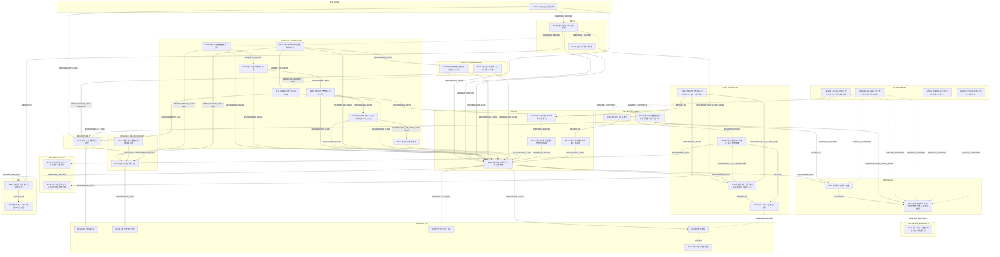

# Validated Observed Partial DAG (동결본)

OBSERVED·DERIVED만 포함한다. LATENT 없음. 점선은 시간·context, x--x는 claim-level 충돌, 실선은 절차·정보·명령·검토·책임 연결이다.

```mermaid
flowchart TD
  subgraph RELATION
    EP01["EP01 구순–김명신 관계 변화"]
  end
  subgraph THEFT
    EP02["EP02 2월 22일 밤 도적 침입 전언"]
    EP03["EP03 구순의 소장과 체포령"]
  end
  subgraph BARRACKS_OPERATION
    EP04["EP04 2월 28일 밤 병영 출동 준비"]
    EP05["EP05 2월 29일 덕평 체포 활동"]
    EP06["EP06 자미덕의 병영 압송·신문·구류"]
    EP07["EP07 한 비장의 석방 조건 제시와 대질 시 거짓 진술"]
    EP09["EP09 3월 4일 병사의 김생원 체포 지시"]
    EP11["EP11 3월 4일 김명신·김갑득 체포"]
    EP12["EP12 한재욱의 안핵 공초"]
  end
  subgraph SUSPECT_INFORMATION
    EP08["EP08 유제희의 현지 탐문과 구순 발언 기록"]
    EP10["EP10 3월 4일 조계완의 구순 집 방문과 서찰"]
  end
  subgraph DETENTION_DEATH
    EP13["EP13 5월 12일 이형원 장계: 구금·무장물·사망·혹형 보고"]
    EP21["EP21 6월 11일 윤노동 별단"]
  end
  subgraph COMMAND_RESPONSIBILITY
    EP14["EP14 5월 12일 이형원의 지휘 계통 평가"]
    EP30["EP30 정조: 이광섭 책임 판단"]
  end
  subgraph THEFT_JUDGMENT
    EP15["EP15 5월 12일 정조 1차 판단: 도난 부재 방향"]
    EP17["EP17 5월 27일 암행어사 이조원 보고: 도난 부재 방향"]
    EP24["EP24 홍대협 도난 판단: 약간의 실제 도난, 좀도둑 수준"]
    EP25["EP25 정조 최종 도난 판단: 실재"]
  end
  subgraph REINVESTIGATION
    EP16["EP16 5월 12일 정조 명: 구순 의금부 구금·엄사"]
    EP19["EP19 5월 27일 정조 명: 구순 의금부 엄수·반복 신문"]
  end
  subgraph REVIEW
    EP18["EP18 5월 27일 정조의 이조원 비판·파직"]
    EP20["EP20 5월 28일 홍대협 공주 안핵어사 차하"]
    EP22["EP22 6월 11일 비변사 처리 보류 청·윤허"]
    EP23["EP23 6월 13일 홍대협 공주목 신문·복명"]
  end
  subgraph BIOLOGICAL
    EP26["EP26 홍대협 사인 평가: 질병"]
    EP27["EP27 정조 사인·처우 판단: 부처 전염병 사망, 곤장·평문 없음"]
  end
  subgraph CAUSATION_BOUNDARY
    EP28["EP28 정조: 구순→김명신 직접 사망 인과 불확실"]
  end
  subgraph RESPONSIBILITY
    EP29["EP29 정조: 구순 책임 연결 판단"]
  end
  subgraph JISE
    EP31["EP31 홍대협: 지세 호칭 기원 미확정"]
    EP32["EP32 정조: 구순 지세 호칭 날조 죄 불인정"]
  end
  subgraph DISPOSITION
    EP33["EP33 구순 신지도 정배"]
    EP34["EP34 이광섭 영동현 유배"]
    EP35["EP35 병영 비장 한가 처분"]
    EP36["EP36 이형원 파직"]
    EP37["EP37 6월 16일 이형원 유임"]
  end
  subgraph ENVIRONMENT
    ENV01["ENV01 1793-01-22 호서 전염병 사망자 치계·구료 단속"]
    ENV02["ENV02 1793-01-22 호서 기근 구휼 한창"]
    ENV03["ENV03 1793-04-10 호서·영남 전염병 창궐(여제)"]
    ENV04["ENV04 1793-05-12 경외 전염병 옥수 치료 명"]
  end
  EP01 -.->|TEMPORAL_BEFORE| EP02
  EP02 -.->|TEMPORAL_BEFORE| EP03
  EP02 -.->|TEMPORAL_BEFORE| EP04
  EP04 -->|ORDER_TO_ACTION| EP05
  EP05 -->|PROCEDURAL_NEXT| EP06
  EP06 -->|PROCEDURAL_NEXT| EP07
  EP07 x--x|CONTRADICTS_AT_CLAIM_LEVEL ?ID02| EP12
  EP09 -->|ORDER_TO_ACTION| EP11
  EP09 -->|PROCEDURAL_NEXT| EP10
  EP10 -.->|TEMPORAL_BEFORE ?ID08| EP11
  EP11 -->|PROCEDURAL_NEXT| EP13
  EP01 -->|INFORMATION_FLOW| EP23
  EP02 -->|INFORMATION_FLOW| EP23
  EP03 -->|INFORMATION_FLOW| EP23
  EP04 -->|INFORMATION_FLOW| EP23
  EP05 -->|INFORMATION_FLOW| EP23
  EP06 -->|INFORMATION_FLOW| EP23
  EP07 -->|INFORMATION_FLOW| EP23
  EP08 -->|INFORMATION_FLOW| EP23
  EP09 -->|INFORMATION_FLOW| EP23
  EP10 -->|INFORMATION_FLOW| EP23
  EP11 -->|INFORMATION_FLOW| EP23
  EP12 -->|INFORMATION_FLOW| EP23
  EP02 x--x|CONTRADICTS_AT_CLAIM_LEVEL| EP24
  EP13 -->|REVIEW_OF ?ID09| EP15
  EP15 -->|PROCEDURAL_NEXT| EP16
  EP16 -.->|TEMPORAL_BEFORE| EP19
  EP17 -->|REVIEW_OF| EP18
  EP17 -->|PROCEDURAL_NEXT| EP19
  EP18 -.->|TEMPORAL_BEFORE| EP20
  EP20 -->|ORDER_TO_ACTION| EP23
  EP21 -->|REVIEW_OF| EP22
  EP22 -->|PROCEDURAL_NEXT| EP23
  EP23 -->|PROCEDURAL_NEXT| EP24
  EP23 -->|PROCEDURAL_NEXT| EP26
  EP23 -->|PROCEDURAL_NEXT| EP31
  EP15 x--x|CONTRADICTS_AT_CLAIM_LEVEL| EP24
  EP17 x--x|CONTRADICTS_AT_CLAIM_LEVEL| EP24
  EP24 -->|REVIEW_OF| EP25
  EP15 -->|REVISES| EP25
  EP13 -->|REVIEW_OF| EP26
  EP26 -->|REVIEW_OF| EP27
  EP13 x--x|CONTRADICTS_AT_CLAIM_LEVEL| EP27
  EP27 -.->|CONTEXT_SUPPORTS| EP28
  EP01 -->|RESPONSIBILITY_LINK| EP29
  EP08 -->|RESPONSIBILITY_LINK ?ID05,ID06| EP29
  EP11 -->|RESPONSIBILITY_LINK| EP29
  EP13 -->|RESPONSIBILITY_LINK| EP29
  EP29 -->|PROCEDURAL_NEXT| EP33
  EP04 -->|RESPONSIBILITY_LINK ?ID07| EP30
  EP09 -->|RESPONSIBILITY_LINK ?ID01| EP30
  EP14 -->|REVIEW_OF| EP30
  EP29 -->|RESPONSIBILITY_LINK| EP30
  EP30 -->|PROCEDURAL_NEXT| EP34
  EP02 -->|REVIEW_OF| EP31
  EP31 -->|REVIEW_OF| EP32
  EP23 -->|PROCEDURAL_NEXT| EP35
  EP23 -->|PROCEDURAL_NEXT| EP36
  EP36 -->|REVISES| EP37
  EP25 -.->|TEMPORAL_BEFORE| EP36
  ENV01 -.->|CONTEXT_SUPPORTS| EP26
  ENV03 -.->|CONTEXT_SUPPORTS| EP26
  ENV01 -.->|CONTEXT_SUPPORTS| EP27
  ENV03 -.->|CONTEXT_SUPPORTS| EP27
  ENV04 -.->|CONTEXT_SUPPORTS| EP27
  ENV02 -.->|CONTEXT_SUPPORTS| EP27
  ENV01 -.->|CONTEXT_SUPPORTS| EP21
  ENV03 -.->|CONTEXT_SUPPORTS| EP21
```
