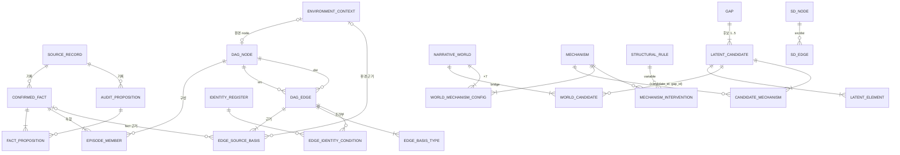

# sql/ — 구순–김명신 사건(1793) Oracle SQL 학습·재구현 레이어

기존 Python/DuckDB 파이프라인(`scripts/gusun_clean/`, `output/clean/`, `database/`, `docs/`)을 **건드리지 않고** 옆에 더한 별도 레이어다. 목적은 두 가지다.

1. 관계형으로 표현되는 데이터 처리와 검증(Audit 1–4)을 Oracle SQL로 **독립 재구현**해서 Python 결과를 다시 검증한다.
2. 이 프로젝트의 실제 데이터를 **SQLD 대비 교재**로 쓴다(조인·서브쿼리·집계·분석 함수·계층형 질의·NULL·집합 연산, 문제 37개).

원칙: additive only. canonical CSV·Python 코드·DuckDB·`docs/`·동결 graph는 그대로다. 이 폴더의 SQL은 canonical 데이터를 읽기만 하고 새 사실·판단·등급을 만들지 않는다. "Oracle로 프로젝트를 갈아엎는 작업"이 아니다.

---

## 1. 실행 상태 — Oracle runtime unavailable

| 항목 | 상태 |
|---|---|
| Oracle 서버 / sqlplus / SQLcl | 작업 환경에 없음. Docker CLI는 있으나 데몬이 꺼져 있고, 데몬 기동은 작업 환경 정책상 허용되지 않았다. Oracle Free 이미지를 띄우지 못했다 |
| Oracle에서 실제 실행 | **하지 않음.** 이 폴더의 어떤 SQL도 Oracle에서 실행 성공을 확인하지 않았다 |
| 문법 검토 | `sqlglot`(Oracle dialect) 파서로 799개 문장 중 795개 파싱. 못 읽은 4개(가상 컬럼 3, 재귀 WITH의 `CYCLE` 절 1)는 Oracle 문서 문법대로인지 수동 검토. SQL*Plus 함정(문장 안 빈 줄, `&`, 주석 끝 `;`) 점검 |
| 스키마·참조 무결성 검토 | DuckDB 논리 에뮬레이션: 실제 canonical 데이터를 STG → canonical로 옮기며 PK·UNIQUE·CHECK·FK(복합 FK 포함) 전부 위반 0, 가상 컬럼 FK 8개는 별도 질의로 위반 0 |
| 결과 대조 | 같은 에뮬레이션에서 SQL Audit 1–4가 Python과 audit × check × severity 단위로 전부 일치(UNRESOLVED 대상 id까지 일치), 기대값 지표 56개 MATCH / DIFF 0, 불변식 20개 위반 0, 결함 주입 15종 15개 탐지 |
| 에뮬레이션으로 못 본 것 | CONNECT BY 계층형 질의 37문장(그래프·drill — 기대 결과는 같은 그래프를 Python으로 따라가 확인), PIVOT/UNPIVOT·KEEP·LNNVL·RATIO_TO_REPORT 등 Oracle 전용 13문장, external table·SQL*Loader 적재 자체 |

에뮬레이션은 Oracle 실행이 아니다. 도구와 한계는 `08_validation/duckdb_logic_check.py` 머리말과 `08_validation/validation_report.md`에 있다. Oracle Free(23ai)나 XE(21c)에서 §3 순서대로 돌리면 같은 결과가 나와야 한다.

---

## 2. 폴더 구조

```
sql/
├─ README.md                         ← 이 문서
├─ 01_schema/
│  ├─ 01_tables.sql                  canonical 표 49개(컬럼·형·NOT NULL·가상 컬럼)
│  ├─ 02_constraints.sql             이름 붙은 PK 49 · FK 52 · UNIQUE 6 · CHECK 76
│  ├─ 03_indexes.sql                 인덱스 37 (FK 인덱스, CONNECT BY 탐색, 함수 기반 UNIQUE)
│  └─ 04_comments.sql                COMMENT ON (데이터 사전)
├─ 02_load/
│  ├─ README.md                      적재 방법 A/B/C와 실행 순서
│  ├─ generate_load_scripts.py       아래 생성물을 canonical CSV header에서 생성
│  ├─ 00_staging_tables.sql          STG_* 25 (생성)
│  ├─ 01_external_tables_or_sqlldr.sql  X_* external table 25 + STG 적재 (생성)
│  ├─ ctl/stg_*.ctl                  SQL*Loader control file 25 (생성)
│  ├─ generated/stg_inserts.sql      INSERT script 1,101행 (생성)
│  ├─ data/*.csv                     DuckDB에만 있던 Python 산출물 3개 추출 (생성)
│  ├─ 02_insert_examples.sql         참조·규칙 표 INSERT + DML 연습(ROLLBACK)
│  ├─ 03_load_validation.sql         적재 검증
│  └─ 04_transform_to_canonical.sql  STG → canonical (정규화·UNPIVOT)
├─ 03_views/                         view 27개
│  ├─ canonical_views.sql · graph_views.sql · audit_views.sql · world_mechanism_views.sql
├─ 04_queries/                       SQLD 개념별 예제
│  ├─ basic_select · joins · subqueries · group_by_having · analytic_functions
│  └─ hierarchical_queries · temporal_queries · null_and_case
├─ 05_audits/                        Audit 1–4 SQL 재구현(검사 84개) + Python 대조
│  ├─ audit_1_episode_fidelity.sql   v_sql_audit_1 (검사 A1-01…A1-23)
│  ├─ audit_2_graph_fidelity.sql     v_sql_audit_2 (A2-01…A2-24)
│  ├─ audit_3_status_separation.sql  v_sql_audit_3 (A3-01…A3-22)
│  ├─ audit_4_mechanism_checks.sql   v_sql_audit_4 (A4-01…A4-15)
│  └─ audit_summary.sql              v_sql_audit_all + Python ↔ SQL 대조
├─ 06_graph/                         계층형 질의(CONNECT BY) 26문장
│  ├─ dag_traversal · ancestor_descendant · cycle_checks · path_queries · review_revision_chain
├─ 07_sqld_drills/                   SQLD 문제 37개(기본 12 · 중간 14 · 어려움 11) + README
└─ 08_validation/
   ├─ compare_with_python.md         Python vs Oracle 비교 항목과 기대값
   ├─ expected_counts.sql            Python 산출물에서 읽은 기대값 + Oracle 독립 계산 + 비교 (생성)
   ├─ extract_expected_from_python.py  위 파일 생성기
   ├─ invariant_checks.sql           DAG 무결성 불변식 20개
   ├─ duckdb_logic_check.py          DuckDB 논리 에뮬레이션(Oracle 아님) + 결함 주입
   └─ validation_report.md           검증 결과 보고
```

---

## 3. 실행 순서 (SQL*Plus / SQLcl, 스키마 사용자)

```sql
SET DEFINE OFF
@sql/01_schema/01_tables.sql
@sql/01_schema/02_constraints.sql
@sql/01_schema/03_indexes.sql
@sql/01_schema/04_comments.sql
@sql/02_load/00_staging_tables.sql
@sql/02_load/generated/stg_inserts.sql          -- 또는 방법 A(external table) / B(SQL*Loader): 02_load/README.md
@sql/02_load/02_insert_examples.sql             -- 1부: 참조·규칙 표
@sql/02_load/04_transform_to_canonical.sql
@sql/02_load/03_load_validation.sql             -- 문제 행만 출력(정상: 비어 있음)
@sql/03_views/canonical_views.sql
@sql/03_views/graph_views.sql
@sql/03_views/audit_views.sql
@sql/03_views/world_mechanism_views.sql
@sql/05_audits/audit_1_episode_fidelity.sql
@sql/05_audits/audit_2_graph_fidelity.sql
@sql/05_audits/audit_3_status_separation.sql
@sql/05_audits/audit_4_mechanism_checks.sql
@sql/05_audits/audit_summary.sql
@sql/08_validation/expected_counts.sql
@sql/08_validation/invariant_checks.sql
-- 학습용: 04_queries/*, 06_graph/* (ancestor_descendant.sql을 path_queries.sql보다 먼저), 07_sqld_drills/*
```

---

## 4. 관계 모델

### 4-1. 엔터티와 식별자

| 영역 | 엔터티(표) | 식별자(PK) | 원본 | 행 수 |
|---|---|---|---|---|
| 원천 | `source_record` 사료 기사 | `source_record_id` | 04_source_records.csv | 8 |
| | `confirmed_fact` 확정 사실 | `fact_id` | 01_confirmed_facts.csv | 50 |
| | `audit_proposition` 감사 전용 명제 | `prop_id` | 05_…AUDIT_ONLY.csv | 156 |
| | `institutional_feature` 제도 피쳐 | `feature_id` | 02_institutional_normative_features.csv | 20 |
| | `environment_context` 환경 | `env_id` | 03_environment_1793.csv | 4 |
| | `input_manifest` 입력 목록 | `file_name` | 00_INPUT_MANIFEST.csv | 5 |
| 관측 DAG | `dag_node` episode·환경 node | `node_id` | episode_nodes.csv | 41 |
| | `dag_edge` 관측 edge | `edge_id` | observed_edges.csv | 68 |
| | `identity_register` 동일성 대장 | `identity_id` | identity_register.csv | 11 |
| | `node_feature_link` 피쳐 평가 링크 | `link_id` | node_feature_links.csv | 57 |
| | `dag_freeze` 동결 기록 | `freeze_name` | observed_dag_freeze.json | 1 |
| LATENT | `gap` 빈칸 | `gap_id` | gaps.csv | 13 |
| | `latent_candidate` 후보 | `candidate_id` (+UK `candidate_id, gap_id`) | latent_candidates.csv | 38 |
| | `latent_element` 후보 안 node·edge | `element_id` | latent_elements.csv | 119 |
| World | `narrative_world` | `world_id` | narrative_worlds.csv | 6 |
| Mechanism | `mechanism` | `mechanism_id` | mechanism_definitions.csv | 7 |
| | `structural_rule` 구조 변수 | `var_id` | qualitative_structural_rules.csv | 10 |
| | `mechanism_interaction` 공존 | (`mechanism_a_id`, `mechanism_b_id`) | mechanism_interaction_matrix.csv | 21 |
| | `mechanism_intervention` 개입 | (`mechanism_id`, `variable`) | mechanism_interventions.csv | 13 |
| | `sd_node` / `sd_edge` Super-DAG | `node_id` / `edge_id` | mechanism_super_dag_*.csv | 122 / 205 |
| 기록 | `warn_disposition` | `warning_id` | warn_dispositions.csv | 6 |
| | `py_audit_finding` Python audit 결과 | `finding_seq` | DuckDB audit_findings | 62 |

연결 테이블(정규화로 생긴 표, 모두 복합 PK): `fact_proposition`, `episode_member`, `identity_fact_ref`, `edge_basis_type`, `edge_source_basis`, `edge_identity_condition`, `gap_anchor_node`, `candidate_identity_condition`, `candidate_evidence`, `candidate_bridge_basis`, `world_candidate`, `world_unresolved_gap`, `world_identity`, `candidate_mechanism`, `world_mechanism_config`, `intervention_candidate`.
규칙 표(Python 상수 이식, 데이터 표에 FK 없음): `ref_confirmation_level`, `rule_set_member`, `rule_required_relation`, `rule_identity_sensitive_pair`, `rule_conflict_pair`, `rule_candidate_negates`, `rule_identity_surface`, `rule_text_pattern`. 검증·기록: `expected_count`, `load_log`.

### 4-2. 관계와 카디널리티



| 관계 | 카디널리티 | 구현 | nullable |
|---|---|---|---|
| 사료 기사 → 확정 사실 | 1 : N (사실은 반드시 기사 1건) | `confirmed_fact.source_record_id` FK | NOT NULL |
| 확정 사실 ↔ audit 명제 | M : N | `fact_proposition` | — |
| episode node ↔ 확정 사실 | M : N (사실 50개가 모두 1개 이상 episode에, CF040·CF045는 절 단위로 2개 episode에) | `episode_member` (+`clause`) | `clause` NULL = 문장 전체 |
| 환경 행 → 환경 node | 1 : 0..1 | `dag_node.env_id` FK | 사건 node는 NULL (CHECK로 강제) |
| node → edge | 1 : N 두 번(src, dst) | `dag_edge.src`, `dst` FK | NOT NULL |
| edge ↔ 근거 | 1 : N, 근거는 fact **또는** 환경(배타적 arc) | `edge_source_basis` + 가상 컬럼 `fact_id`/`env_id` FK | 둘 중 하나만 값 |
| edge ↔ 미확정 동일성 | M : N (실데이터 4건) | `edge_identity_condition` | — |
| 피쳐 → node 또는 edge | 다형 대상·다형 피쳐 | `node_feature_link` 가상 컬럼 4개 FK | 대상·피쳐마다 하나만 값 |
| gap → 후보 | 1 : 1..5 | `latent_candidate.gap_id` FK, 개수는 Audit 3 | NOT NULL |
| world ↔ 후보 | M : N, world마다 gap당 후보 ≤ 1 | `world_candidate` + `UNIQUE(world_id, gap_id)` + 복합 FK `(candidate_id, gap_id)` | — |
| 후보 ↔ 메커니즘 | M : N, 후보마다 PRIMARY 정확히 1 | `candidate_mechanism` + 함수 기반 UNIQUE 인덱스 | — |
| world × 메커니즘 configuration | 6 × 7 = 42 | `world_mechanism_config` (CSV 가로표를 UNPIVOT) | — |
| 개입 → 후보 | M : N (REMOVED / REMAINING) | `intervention_candidate`, 복합 FK | — |

### 4-3. open set · unresolved 관계를 다루는 방식

- **미확정 동일성은 대장에만 둔다.** `identity_register.status = 'UNRESOLVED'`(ID04·06·07·08)는 오류가 아니라 보존된 불확실성이다. 동일성 의존은 행으로 표현한다(`edge_identity_condition`, `candidate_identity_condition`, `world_identity`). edge를 두 표면형 중 하나로 합치지 않는다.
- **사용자 확정은 제약으로 지킨다.** `ck_identity_resolution`: RESOLVED면 `resolved_by = 'USER'`와 `resolution_basis`가 있어야 한다.
- **열린 목록(…등)은 닫지 않는다.** `audit_proposition.set_status = 'OPEN_SET%'`인 명제를 근거로 한 episode는 summary에 열린 집합 표지가 남아야 한다(Audit 1 A1-20).
- **열린 gap은 비워 둔다.** `gap.gap_status = 'OPEN_UNRESOLVED'`(G10)는 어떤 world도 채우지 않는다(Audit 3 A3-21). "모든 경쟁 world가 비워 둔 gap"은 관계 나눗셈으로 찾는다(A3-20).
- **부분 충돌은 UNRESOLVED로 남긴다.** `dag_edge.uncertainty_status`(PARTIAL_CONFLICT·UNRESOLVED_SCOPE·CONDITIONAL_UNRESOLVED_IDENTITY).
- **날짜가 없으면 NULL.** EP08처럼 발생일이 기록되지 않은 사건에 날짜를 만들지 않는다. 열린 구간('…이후')은 `t_max IS NULL`.

### 4-4. 데이터형 선택

| 선택 | 이유 |
|---|---|
| 한글 컬럼 `VARCHAR2(n CHAR)` | AL32UTF8에서 한글 1글자 = 3 byte. BYTE 기준으로 잡으면 글자 수가 1/3이 된다. 실측 최대 글자 수의 1.5–3배로 잡았다 |
| 코드·ID `VARCHAR2(n)` | ASCII라 BYTE = CHAR |
| `narrative_world.narrative` → `CLOB` | 실측 최대 3,248 byte로 4,000 byte 한도에 가깝다. 그 밖의 서술은 모두 VARCHAR2로 충분(최대 793 byte) |
| `t_min`·`t_max` → `NUMBER(4)` | Python과 같은 음력 MMDD 정수(3월 4일 = 304). 정렬·비교용 |
| 음력 날짜 → `VARCHAR2(10)` + CHECK(`YYYY-MM-DD` 형식) | 음력이라 그레고리력 DATE가 아니다. `1793-02-29`는 1793년 양력에 없는 날이고, `1793-02 초순`처럼 정밀도가 낮은 값도 있다. 고정 길이 'YYYY-MM-DD'는 문자열 비교가 날짜순과 같다 |
| `DATE` vs `TIMESTAMP` | 사건 날짜에는 쓰지 않는다. 적재 기록 `load_log`에서만 `load_day DATE`(초 단위)와 `loaded_at TIMESTAMP(6)`(마이크로초)를 비교용으로 쓴다 |
| `claim_level` → `VARCHAR2(5)` CHECK('True','False') | CSV 원문 그대로. Oracle 23ai 이전에는 BOOLEAN 컬럼이 없다 |
| 다중 값 원문 컬럼 유지 | `supporting`·`basis` 같은 '\|' 목록 원문은 canonical 표에도 남기고(Python 산출물과 같은 값), 정규화본은 연결 테이블에 둔다. 둘의 일치는 03_load_validation이 확인 |

### 4-5. CSV header → Oracle 컬럼 이름이 바뀐 곳

Oracle 예약어(BETWEEN, DESC, AUDIT)와 한글·공백 header만 바꿨다. 나머지는 CSV header와 같다.

| 원본 | Oracle |
|---|---|
| gaps.`between` | `between_nodes` |
| qualitative_structural_rules.`var` / `desc` / `constraint` | `var_id` / `rule_desc` / `constraint_text` |
| mechanism_definitions.`아주 쉬운 설명` · `관련 candidate` · `관련 observed node` · `필요한 institutional feature` · `관련 environment feature` · `evidence status` · `비고` | `easy_description` · `related_candidates` · `related_observed_nodes` · `required_inst_features` · `related_env_features` · `evidence_status` · `remarks` |
| mechanism_interaction_matrix.`mechanism A` · `mechanism B` · `이유` · `충돌하는 candidate/edge` · `같이 있을 때 설명되는 것` · `mechanism_a` · `mechanism_b` | `mechanism_a_id` · `mechanism_b_id` · `reason` · `conflicting_items` · `explained_together` · (`mechanism_a_name` · `mechanism_b_name`: staging에만, canonical에서는 3NF로 제거) |
| mechanism_interventions.`mechanism` | canonical `mechanism_id` (staging은 `mechanism`) |
| DuckDB audit_findings.`audit` | `audit_name` |
| observed_dag_freeze.json `name` | `freeze_name` |

---

## 5. SQLD 개념 매핑표

| SQLD 개념 | 프로젝트에서 쓰인 위치 | SQL 파일 | 실제 의미 |
|---|---|---|---|
| SELECT / WHERE / 비교 연산 | 음력 3/4 사건 찾기 | `04_queries/basic_select.sql`, drill Q2 | 발생일(t_min)과 기록일 구분 |
| LIKE · ESCAPE | 제목·layer 검색 | `basic_select.sql`, drill Q3 | 판단 node 찾기 |
| BETWEEN · IN | 2/22–3/4 사건, 판단 layer | `basic_select.sql` | 시간 구간·범주 필터 |
| ORDER BY · NULLS LAST | 발생 순 정렬 | `basic_select.sql`, `null_and_case.sql` | 날짜 미기록 EP08을 뒤로 |
| Top-N (FETCH FIRST / ROWNUM) | 추가 가정 최다 후보 | `basic_select.sql`, drill Q4 | WITH TIES·ROWNUM 함정 |
| INNER JOIN | edge ↔ source basis ↔ 확정 사실 | `joins.sql`, drill Q5 | edge 근거 연결 |
| OUTER JOIN · (+) | node ↔ 피쳐 링크(0건 포함) | `joins.sql`, drill Q7 | 근거 없는 대상도 남기기 |
| SELF JOIN | edge의 src·dst node 이름, 2단계 검토 | `joins.sql`, drill Q6 | 판단을 검토한 판단 |
| NON-EQUI JOIN | 환경 시점 ≤ 판단 시점 | `joins.sql` | 판단 이전 환경만 맥락 |
| CROSS JOIN | world × gap 격자 | `joins.sql`, drill Q34 | 비운 gap 찾기 |
| FULL OUTER JOIN | Python ↔ SQL audit 대조 | `05_audits/audit_summary.sql`, drill Q37 | 한쪽에만 있는 결과 |
| 복합 FK 조인 | world_candidate ↔ latent_candidate | `joins.sql`, `02_constraints.sql` | 후보·gap 짝 강제 |
| 스칼라 서브쿼리 | node별 진출 edge 수 | `subqueries.sql` | 행마다 한 값 |
| 인라인 뷰 | 집계 후 필터, 분석 함수 후 필터 | `subqueries.sql`, drill Q19·Q20 | QUALIFY 대체 |
| EXISTS | 미확정 동일성을 쓰는 edge | `subqueries.sql` | semi-join |
| NOT EXISTS | unsupported edge, omission | `audit_1·2`, drill Q13·Q14 | 근거 없는 edge·누락 fact 탐지 |
| NOT IN · NULL 함정 | 환경 행 사용 여부 | `subqueries.sql`, drill Q29 | NULL 하나로 결과 0행 |
| 관계 나눗셈(이중 NOT EXISTS) | 모든 경쟁 world가 비운 gap, W5 포함 world | `audit_3` A3-20, drill Q16 | '모든'을 SQL로 |
| 다중 컬럼 IN | 필수 관계(src, dst, type) 존재 | `subqueries.sql` | 튜플 비교 |
| WITH 절 | 진술자 집계, world 격자 | `subqueries.sql`, drill Q34·Q36 | 단계별 질의 |
| GROUP BY · HAVING | source별 episode 수 ≥ 3 | `group_by_having.sql`, drill Q9 | 그룹 조건 |
| COUNT(*) vs COUNT(col) | t_max 없는 node, 조건부 edge | `null_and_case.sql`, drill Q27 | NULL은 세지 않음 |
| 조건부 집계(CASE in 집계) | 등급 분포, OBSERVED/DERIVED | `group_by_having.sql`, drill Q11·Q12 | 수동 PIVOT |
| ROLLUP · CUBE · GROUPING SETS · GROUPING | Super-DAG status·type 소계 | `group_by_having.sql`, drill Q11 | 소계·총계 |
| KEEP (DENSE_RANK FIRST) | gap별 가정 최소 후보 | `group_by_having.sql` | Oracle 집계 |
| 중복 탐지 | 같은 (보고자, 주제) 명제, 중복 edge | `group_by_having.sql`, `06_graph/cycle_checks.sql` | duplicate detection |
| ROW_NUMBER | judgment ordering, 최신 판단, 중복 제거 | `analytic_functions.sql`, drill Q17·Q20 | 판단 순서 |
| RANK / DENSE_RANK | 같은 날(6/13) 판단 순위 | `analytic_functions.sql`, drill Q18 | 동점 처리 차이 |
| LAG / LEAD | review sequence, 절차 순서 | `analytic_functions.sql`, `temporal_queries.sql`, drill Q19 | 이전 판단 비교 |
| FIRST_VALUE / LAST_VALUE | branch 첫·마지막 판단 | `analytic_functions.sql`, drill Q21 | 기본 창 함정 |
| COUNT OVER / SUM OVER | 기사별 사실 수, 누적 사실 수, 이동 합 | `analytic_functions.sql` | 행을 줄이지 않는 집계 |
| NTILE · RATIO_TO_REPORT | 후보 3구간, edge type 비율 | `analytic_functions.sql` | 구간·비율 |
| CONNECT BY · START WITH · PRIOR | DAG traversal | `06_graph/dag_traversal.sql`, drill Q22 | 사건 경로 추적 |
| PRIOR 위치(역방향) | 판단의 조상 | `ancestor_descendant.sql`, drill Q24 | 근거 거슬러 오르기 |
| LEVEL · SYS_CONNECT_BY_PATH | 경로 깊이·경로 문자열 | 06_graph 전체 | 경로 표현 |
| CONNECT_BY_ROOT | 경로 출발 관측, 전이 폐쇄 | `ancestor_descendant.sql`, `path_queries.sql` | 출발점 추적 |
| CONNECT_BY_ISLEAF | 끝 node까지 경로 | `dag_traversal.sql`, drill Q23 | 처분·판단의 끝 |
| NOCYCLE · CONNECT_BY_ISCYCLE | cycle detection | `cycle_checks.sql`, `audit_2` A2-24, drill Q25 | DAG 무결성 |
| ORDER SIBLINGS BY | 계층 모양 유지 정렬 | 06_graph 전체 | 형제끼리 정렬 |
| CONNECT BY 조건 vs WHERE | 정보 흐름 edge 자르기 vs 숨기기 | `dag_traversal.sql` Q4, drill Q22 | 가지 전체 vs 행만 |
| 행 생성기(CONNECT BY LEVEL) | '\|' 목록을 행으로 | `02_load/04_transform_to_canonical.sql` | 정규화 |
| CASE | status classification | `null_and_case.sql`, drill Q28 | 상태 분류 |
| DECODE | 등급 → 점수 | `null_and_case.sql`, `audit_views.sql` | Oracle CASE 축약 |
| NVL · NVL2 · COALESCE · NULLIF · LNNVL | 정렬 키, 열린 구간 | `null_and_case.sql` | NULL 처리 |
| '' = NULL | CSV 빈 칸 적재 | `null_and_case.sql`, `02_load` | Oracle 특유 |
| UNION / UNION ALL | 동일성 조건 합집합 | `08_set_operators.sql` drill Q30 | 중복 제거 여부 |
| INTERSECT | 두 world 공통 bridge, 두 판단 공통 조상 | drill Q31, `ancestor_descendant.sql` | 교집합 |
| MINUS | world 차집합, frozen edge 대조 | drill Q32·Q33, `audit_4` A4-03 | 차집합·대칭 차집합 |
| PIVOT / UNPIVOT | world × 메커니즘 configuration | `03_views/world_mechanism_views.sql`, `04_transform_to_canonical.sql` | 가로 ↔ 세로 |
| 정규식 함수 | 진술자 추출, 표지 개수, 금지 단정 | `audit_views.sql`, `audit_1` | REGEXP_LIKE/SUBSTR/COUNT |
| INSERT ALL · MERGE · SAVEPOINT · ROLLBACK | 규칙 표 적재, DML 연습 | `02_load/02_insert_examples.sql` | DML·트랜잭션 |
| PK · FK · UNIQUE · CHECK · NOT NULL | 상태값 제한, self-loop 금지, gap당 후보 1 | `01_schema/02_constraints.sql` | 무결성 제약 |
| 가상 컬럼 · 함수 기반 인덱스 | 배타적 FK(arc), PRIMARY 1개 | `01_tables.sql`, `03_indexes.sql` | Oracle 기법 |
| 정규화(1NF·3NF) | '\|' 목록 → 연결 테이블, 메커니즘 이름 제거 | `04_transform_to_canonical.sql` | 반복 그룹·이행 종속 제거 |
| VIEW | audit 결과, 그래프 차수 | `03_views/*`, `05_audits/*` | 저장된 SELECT |

---

## 6. Python 로직 → SQL 이식 범위

### SQL로 옮긴 것

| 영역 | 내용 |
|---|---|
| 적재·정규화 | CSV → staging → canonical, '\|' 목록 13종 정규화, 가로 configuration UNPIVOT, 메커니즘 매핑(Super-DAG edge에서 추출) |
| Audit 1 (23 검사) | 누락(omission), unsupported episode, 절 substring, 중복 소속, provenance, 과병합(사료·인식 계열·진술자), 지시/실행 병합, 강한·한정 어휘(STRONG_TERMS·HEDGES), epistemic collapse, 진술 귀속, 시간 병합, 표면형 치환·인물 삽입, 인식 표지 13종 개수, actor substitution, 발생일/기록일 혼동, 책임→사인·환경→개인 단정, 열린 집합, 절↔명제 정렬, 동일성 확정/미확정 |
| Audit 2 (24 검사) | 끝점·type·basis·status, 근거 없음, endpoint 밖 근거(CF035 예외), 제도만 근거, 환경 누출 4종, 시간 역전, 진술 간 claim_level, 책임 link 대상, self ORDER_TO_ACTION, 동일성 민감 쌍 condition, stale/모르는 condition, 조건부 edge(UNRESOLVED), 부분 충돌(UNRESOLVED), 근거 문구 단정, 직접 사망 edge 금지, 필수 관계 17개, 고립 node, 판단 node 삭제, node 근거, feature link, cycle |
| Audit 3 (22 검사) | 동일성 대장 규칙, 동결 집계, LATENT→OBSERVED, orphan 후보, latent node 표지, latent edge 6종, provenance, 등급 규칙, bridge 재감사 8종(부풀림·시간·제도·endpoint leakage·final 일관성), support_basis 상한, 확정 동일성 충돌, 후보 서술 단정, audit-only 지지, 후보 예산, world 무결성, [L] 표지(CLOB), world 서술 단정, world 쌍 차이, 공통 결말, unresolved gap(관계 나눗셈), open gap 채움 |
| Audit 4 (15 검사) | frozen node·edge 보존(MINUS 대칭 차집합), 새 관측 사건 금지, LATENT 표시, Super-DAG edge 규칙(제도·환경→사건), branch A/B 분리, W6 재활성, configuration 모순, INCOMPATIBLE 공존, world 병합, 공통 결말, UNRESOLVED 4종(공존 미결·방향 미결·복수 설명·미결 항목) |
| 무결성 | orphan node/edge, missing source basis, self-loop, duplicate edge, reversed temporal edge, cycle, unresolved identity forcing, LATENT→OBSERVED, direct causal death edge, environment→individual leakage 등 불변식 20개 |
| 시간 | 발생/기록일 대조, 시간 역전, review sequence, 5월→6월 번복 순서, arrest → detention → review → final judgment 순서 |

### NOT PORTED TO SQL (억지로 옮기지 않은 것)

| 항목 | 이유 |
|---|---|
| Audit 1 `semantic_weakening` 원문 어휘 보존율(0.6/0.8 임계) | 공백 토큰화 + 어간 1글자 절단 + 비율 계산. SQL로 흉내 내면 Python과 다른 토큰화가 되어 '독립 검증'이 아니라 '다른 검사'가 된다 |
| Audit 1 omission의 '절 분할 후 남은 원문' | 절마다 REPLACE를 반복하는 문자열 대수. 절 분할 사실(INFO)과 절 substring 검사는 옮겼다 |
| Audit 2·3 `IDENTITY_TEXT_RULES` 서술 정규식, Audit 3 `open_set_closure` | `(?!\s*\(病)`, `(?<!정)원돌`, `(?!·)` 같은 전후방 탐색. Oracle 정규식(POSIX ERE)에는 전후방 탐색이 없다. node 쌍 기반 동일성 검사와 열린 집합 표지 검사는 옮겼다 |
| Audit 3 `environmental_leakage`(환경만으로 개인 수준 latent node) | latent node의 `individual_level` 값이 CSV로 내보내지지 않았다(Python 내부 필드) |
| Audit 3·4 동결 sha256 재계산 | Python `json.dumps` 직렬화를 바이트 단위로 재현해야 한다. 대신 집계 대조(A3-02)와 frozen edge 대칭 차집합(A4-03)으로 본다. 해시 값은 `dag_freeze`에 보존 |
| Audit 4 world configuration 값 재계산(`world_config`) | 후보의 core/보조 구분과 메커니즘별 key gap이 CSV에 없다. 계산된 configuration이 규칙과 모순되지 않는지만 검사(A4-08) |
| Audit 5 interactive visualization 전체 | `docs/data/*.json`·CSS·화면 좌표·글자 크기 검사. 관계형 데이터가 아니다 |
| stage 1–7 생성 로직(episode 구성, 후보 등급 `grade()`·`prune()`, world 선택, 화면 배치) | 사람이 정한 판단·생성 규칙이다. SQL은 그 결과를 검증만 한다 |
| Python 그래프 알고리즘(DFS 등) 그대로 옮기기 | CONNECT BY로 같은 '질문'(도달·cycle·경로)에 답하고, 알고리즘 자체를 옮기지 않았다 |

---

## 7. Oracle 버전별 주의

| 기능 | 최소 버전 | 쓰인 곳 | 낮은 버전 대안 |
|---|---|---|---|
| CONNECT BY, NOCYCLE, CONNECT_BY_ISCYCLE/ISLEAF/ROOT | 10g | 06_graph, audits | — |
| 정규식 함수, REGEXP_SUBSTR 부분식 인자, REGEXP_COUNT | 11g | views, audits, load | — |
| 가상 컬럼(GENERATED ALWAYS AS … VIRTUAL)과 가상 컬럼 FK | 11g | `edge_source_basis`, `node_feature_link`, `candidate_evidence` | 실제 컬럼 2개 + CHECK로 배타 관계 |
| PIVOT / UNPIVOT(다중 컬럼) | 11g | transform, `v_world_mechanism_matrix` | CASE 집계 / UNION ALL |
| LISTAGG | 11gR2 | 여러 곳 | — |
| 재귀 WITH(+ CYCLE 절) | 11gR2 | `hierarchical_queries.sql` 참고 예제 1개 | CONNECT BY |
| FETCH FIRST … ROWS ONLY / WITH TIES | 12c | basic_select, drill Q4 | ROWNUM 인라인 뷰(같은 파일에 병기) |
| external table `FIELDS CSV WITH EMBEDDED` | 12.2 | 쓰지 않음(필드 안 줄바꿈이 없어 불필요) | — |
| MINUS의 동의어 EXCEPT | 21c | 쓰지 않음(MINUS만) | — |
| GROUP BY에 SELECT 별칭, BOOLEAN, 다중 행 VALUES | 23ai | 쓰지 않음 | 인라인 뷰, VARCHAR2 플래그, INSERT ALL |

이름 길이는 30자 이내(12.1 이하 호환)로 맞췄다. Oracle XE 21c·Oracle Free 23ai에서 모두 쓸 수 있는 문법만 썼다.

---

## 8. 금지 문법 점검

PostgreSQL/DuckDB 전용 문법 `QUALIFY`, `FILTER (WHERE …)`, `::` 형 변환, `LIMIT`, BOOLEAN 컬럼, `generate_series`, `WITH RECURSIVE`를 쓰지 않았다(전체 SQL에서 grep 확인 — `REJECT LIMIT`은 Oracle external table 문법). Top-N은 `FETCH FIRST`/`ROWNUM`, 행 생성은 `CONNECT BY LEVEL`, 분석 함수 필터는 인라인 뷰로 쓴다.

---

## 9. 다시 만들기

```bash
pip install duckdb sqlglot                              # 생성기·에뮬레이터용(Oracle과 무관)
python3 sql/02_load/generate_load_scripts.py            # staging·external·ctl·INSERT·data/*.csv
python3 sql/08_validation/extract_expected_from_python.py   # expected_counts.sql
python3 sql/08_validation/duckdb_logic_check.py sql/03_views/*.sql sql/05_audits/audit_[1-4]*.sql \
        sql/05_audits/audit_summary.sql sql/08_validation/expected_counts.sql \
        sql/08_validation/invariant_checks.sql --mutations   # Oracle이 아닌 논리 에뮬레이션
```

`03_views`의 네 파일은 서로의 view를 참조하지 않으므로 어떤 순서로 실행해도 된다(파일 안에서는 위에서 아래 순서). `05_audits`는 `03_views` 뒤, `audit_summary.sql`은 audit 1–4 뒤, `08_validation`은 그 뒤에 실행한다.
